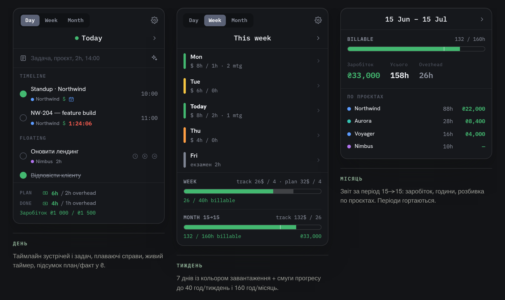
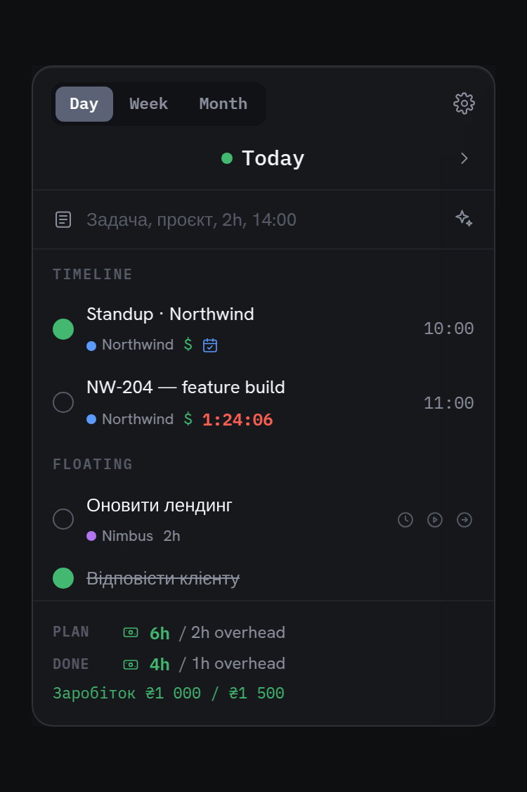
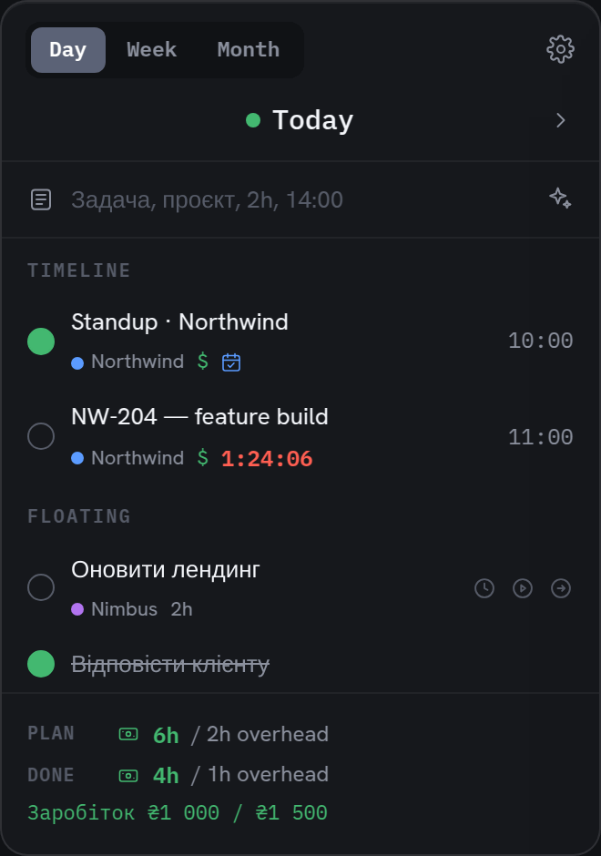
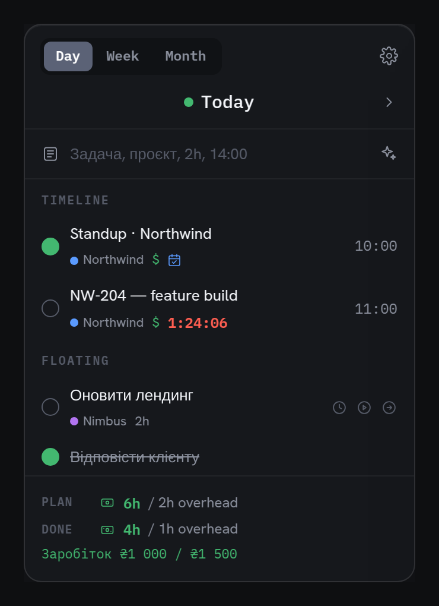
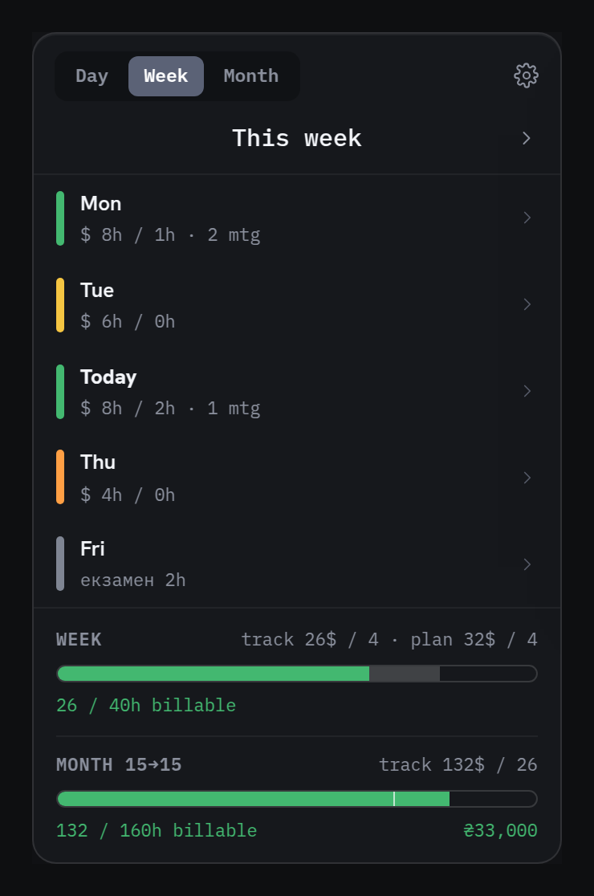
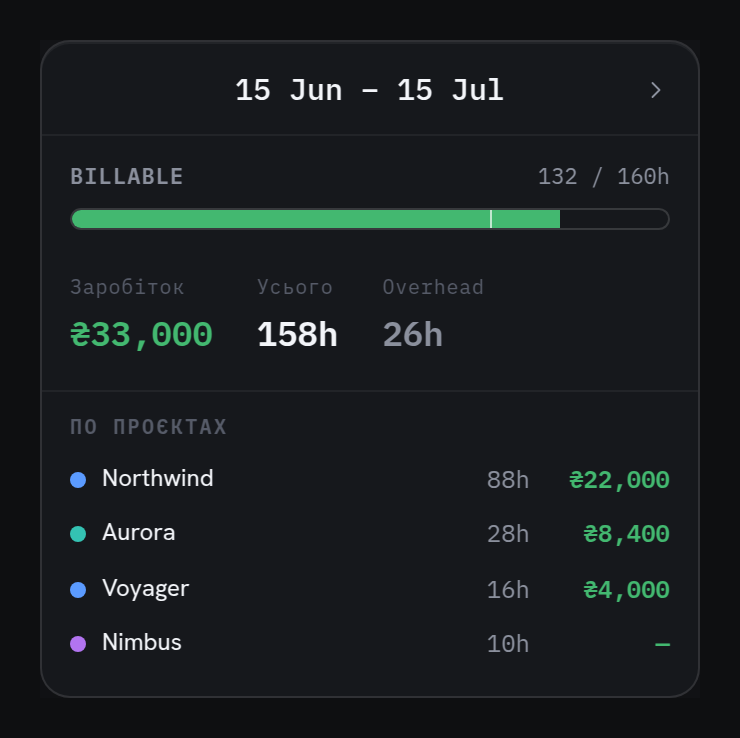

<h1 align="center">Doba</h1>

<p align="center">
  A tiny day planner & time tracker that lives in your macOS menu bar.<br>
  <em>Plan your day, see where the hours go, and keep it simple.</em>
</p>

<p align="center">
  <b>Live page →</b> <a href="https://andrewrozumny.github.io/Doba/">https://andrewrozumny.github.io/Doba/</a>
</p>

<p align="center">
  
</p>

---

I built **Doba** for myself, to stop losing track of where my workday goes. It’s a small native
app that sits in the menu bar: you add tasks, check them off, push them to later, and start a
timer when you actually start working. At the end of the day, week and month it shows you a plain,
honest summary of the hours.

It’s free, open source, and everything stays on your Mac — no cloud, no account, no sign-up.
If it’s useful to you too, great. Help yourself. 🙂

## What it does

- **Day · Week · Month** — a plan for today, a color-coded week, and a monthly summary. Step through past days, they become your archive.
- **Add → do → defer** — the whole task flow in two clicks. Carry unfinished work over to today.
- **Parallel timers** — run timers on several tasks at once. When a task’s time is up, **Doba pings you and stops the timer on its own** — a sound, a notification, and an alert that pops up over everything on the screen you’re working on (so you catch it mid-call).
- **See where the hours go** — every task is *billable* or *overhead*; both numbers are shown everywhere. Optional goals: 40 h/week and 160 h/period.
- **Natural-language entry** *(optional)* — type “call with client, Nimbus, 1h, 11:30” and let Claude fill in the project, hours, time and billable flag. Needs your own Anthropic API key.
- **Read-only calendar** — meetings from your system calendar (EventKit) merge into the timeline; turn any meeting into a task in one click.
- **Global hotkey ⌃⌥D** — a quick-capture field pops up from any app. Type, hit Enter, done.
- **Simple reports** — weekly and monthly (15→15) breakdowns: earned, worked, per-project.

<table>
  <tr>
    <td align="center" width="50%">
      <br>
      <sub>Day · Week · Month</sub>
    </td>
    <td align="center" width="50%">
      <br>
      <sub>Live timer that pings and stops at the limit</sub>
    </td>
  </tr>
</table>

## Screenshots

| Day | Week | Month |
|-----|------|-------|
|  |  |  |

## Install

You’ll need a Mac and Xcode.

```bash
git clone https://github.com/andrewrozumny/Doba.git
cd Doba

# set your bundle prefix + Apple Team ID (kept out of git)
cp Config/Doba.xcconfig.example Config/Doba.xcconfig   # then edit it

# the Xcode project is generated with XcodeGen
brew install xcodegen      # if you don't have it
xcodegen

open Doba.xcodeproj         # then build & run with ⌘R
```

**Optional — natural-language entry:** open Settings inside the app and paste your own
[Anthropic API key](https://console.anthropic.com/). It’s stored in the macOS Keychain and never
leaves your machine. Everything else works without it.

## Under the hood

Native and dependency-free, with a clean tested core:

- **SwiftUI** menu-bar app + **WidgetKit** widget
- A shared **DobaKit** framework — models, storage and all logic as pure, tested functions
- **EventKit** (calendar), **UserNotifications**, a Carbon global hotkey, **Keychain** for secrets
- Data is a single local JSON file. The API key lives only in the Keychain, never in code.

## Privacy

Everything is local. No backend, no telemetry, no accounts. The only network call Doba can make is
to the Anthropic API — and only if *you* add a key and use natural-language entry.

## Status

A personal weekend project, shared as-is. I’m not promising a roadmap or support, but issues and
pull requests are welcome if something’s broken or you make it better.

## License

[MIT](LICENSE) — do what you like, no warranty.

---

<p align="center">
  <a href="https://github.com/andrewrozumny">GitHub</a> ·
  <a href="https://helpmybiz.org/">helpmybiz.org</a> ·
  <a href="https://www.upwork.com/freelancers/arozumny">Upwork</a>
</p>

<p align="center"><sub>Made with SwiftUI · Doba · 🇺🇦</sub></p>
